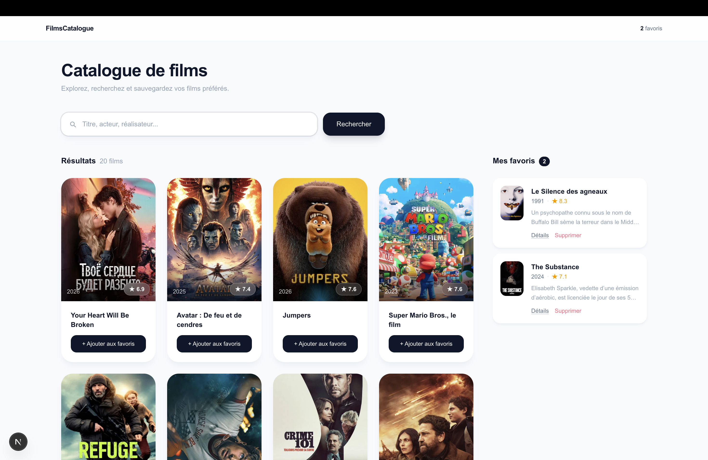
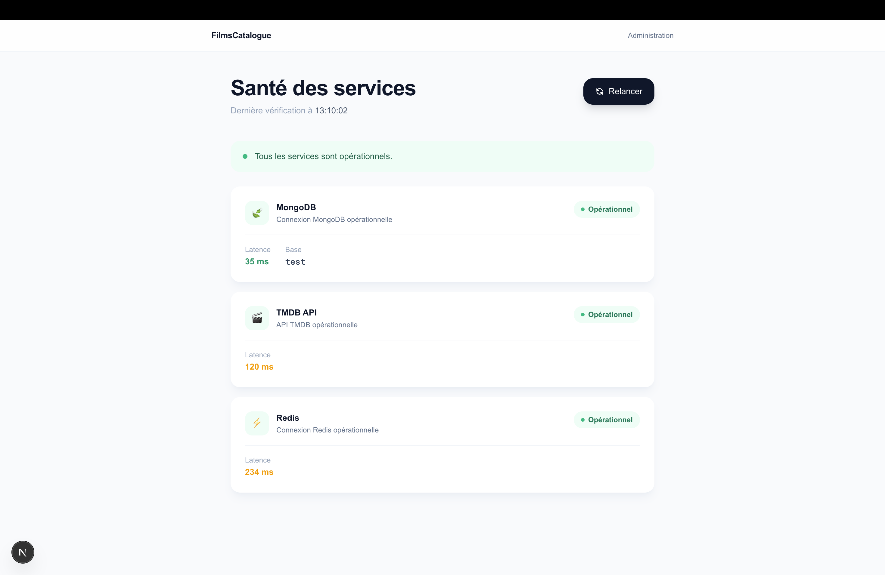
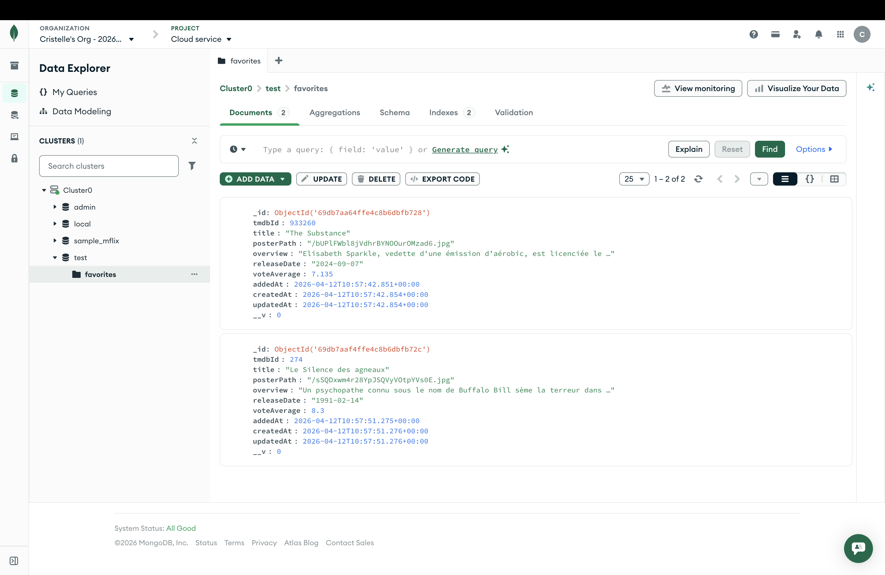
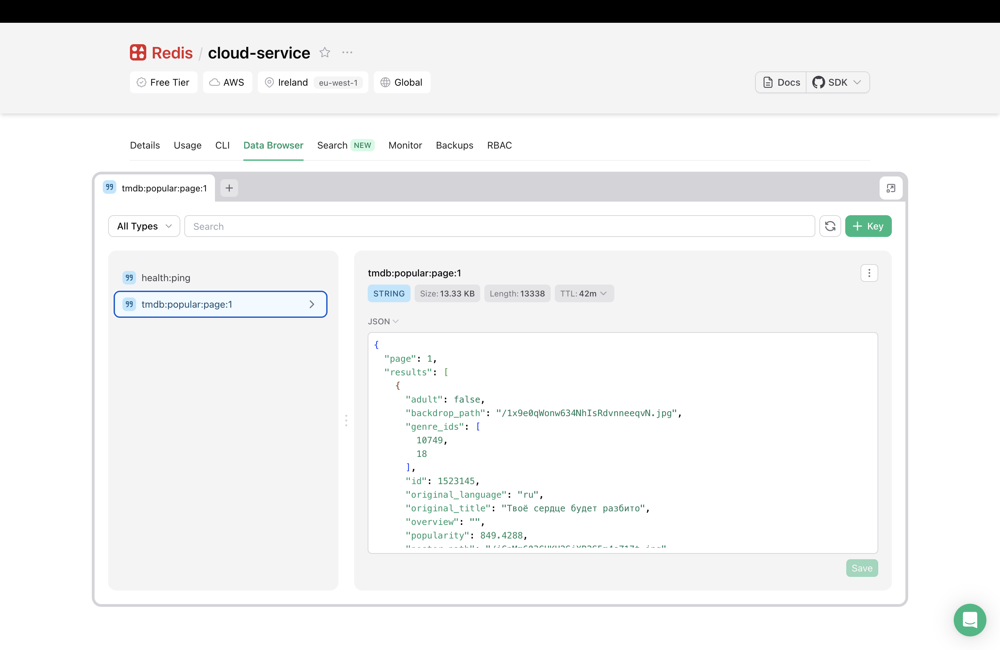
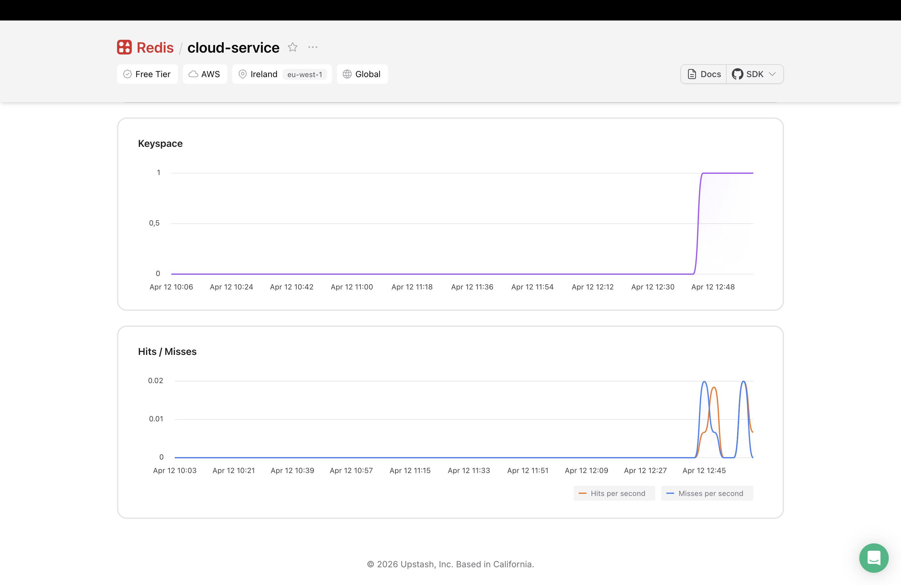
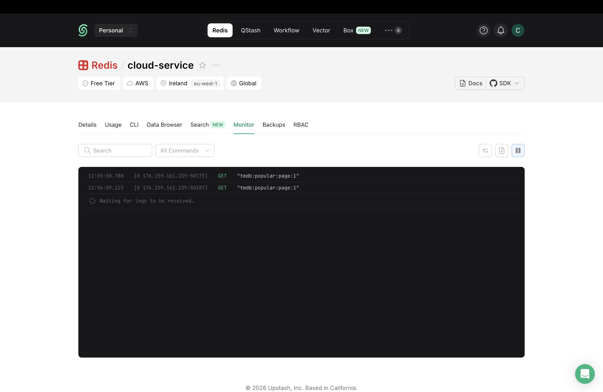

# Cloud Service : Projet de catalogue de films

Application Next.js fullstack permettant de rechercher des films via l'API TMDB, de les ajouter en favoris (stockés dans MongoDB) et de bénéficier d'un cache Redis pour améliorer l'expérience.



---

## Stack technique

- **Next.js 16** (App Router, webpack)
- **MongoDB / Mongoose** : persistance des favoris
- **Upstash Redis** : cache des films populaires
- **TMDB API** : source des données films
- **Tailwind CSS** : interface

### Aperçu des pages




### Données & monitoring






---

## Prérequis

- Node.js 18+
- Un compte [MongoDB Atlas](https://www.mongodb.com/atlas)
- Un compte [Upstash](https://upstash.com/) (Redis serverless)
- Une clé API [TMDB](https://www.themoviedb.org/settings/api)

---

## Installation

```bash
# 1. Cloner le dépôt
git clone <url-du-repo>
cd cloud-service

# 2. Installer les dépendances
npm install
```

---

## Configuration des variables d'environnement

Créer un fichier `.env.local` à la racine du projet :

```env
# MongoDB
MONGODB_URI=mongodb+srv://<user>:<password>@cluster0.xxxxx.mongodb.net/?appName=Cluster0

# TMDB
TMDB_BASE_URL=https://api.themoviedb.org/3
TMDB_API_KEY=<votre_clé_tmdb>

# Upstash Redis
UPSTASH_REDIS_REST_URL=https://<votre-instance>.upstash.io
UPSTASH_REDIS_REST_TOKEN=<votre_token>
```

---

## Lancer le projet

```bash
# Développement (webpack, sans Turbopack)
npm run dev

# Build de production
npm run build

# Serveur de production
npm start
```

L'application est accessible sur [http://localhost:3000](http://localhost:3000).

---

## Pages et endpoints

### Pages

| Route | Description |
|-------|-------------|
| `/movies` | Catalogue de films, recherche et gestion des favoris |
| `/admin` | Dashboard de santé des services (MongoDB, TMDB, Redis) |

### API

| Méthode | Route | Description |
|---------|-------|-------------|
| `GET` | `/api/movies` | Films populaires (avec cache Redis) |
| `GET` | `/api/movies?search=batman` | Recherche de films |
| `GET` | `/api/movies?page=2` | Films populaires page N |
| `GET` | `/api/favorites` | Liste tous les favoris |
| `POST` | `/api/favorites` | Ajoute un film en favori |
| `GET` | `/api/favorites/:id` | Récupère un favori par son ID MongoDB |
| `DELETE` | `/api/favorites/:id` | Supprime un favori |
| `GET` | `/api/health/mongodb` | Santé de la connexion MongoDB |
| `GET` | `/api/health/tmdb` | Santé de l'API TMDB |
| `GET` | `/api/health/redis` | Santé de la connexion Redis |

---

## Questions de réflexion

### 1. Quelle est la différence de latence entre un cache miss et un cache hit ?

D'après les mesures effectuées en développement :

| Appel | Latence `application-code` |
|-------|---------------------------|
| Cache MISS (appel TMDB) | ~200–400 ms |
| Cache HIT (lecture Redis) | ~4–15 ms |

Le gain est de l'ordre de **×20 à ×50**. La latence résiduelle sur les HIT correspond au temps que prend le réseau pour faire l'aller-retour jusqu'à Upstash (hébergé en edge, ~5–30 ms selon la région).

### 2. Pourquoi ne pas mettre en cache les résultats de `searchMovies` avec un TTL long ?

Trois raisons :

- **Variabilité des requêtes** : les termes de recherche forment un espace quasiment infini. Mettre chaque résultat en cache viderait Redis sans jamais être réutilisé.
- **Pertinence temporelle** : TMDB ajoute des films en continu. Un résultat mis en cache hier pour "batman" peut ne plus refléter les nouveautés.
- **Coût vs bénéfice** : les films populaires sont demandés des milliers de fois avec les mêmes paramètres (`page=1`). Une recherche utilisateur est par définition personnelle et peu répétée.

Un TTL court (60–300 s) serait acceptable pour des termes très populaires, mais reste de la sur-optimisation dans la plupart des cas.

### 3. Que se passe-t-il si Redis est indisponible ? Comment rendre le code résilient ?

Sans protection, si Upstash est down, `redis.get()` lève une exception qui remonte jusqu'au `catch` de la route → **500** pour l'utilisateur, alors que TMDB est parfaitement accessible.

La solution est d'envelopper les appels Redis dans un try/catch dédié et continuer vers TMDB en cas d'échec.

**Principe** : Redis est une optimisation, pas une dépendance critique. L'application doit fonctionner (plus lentement) même si le cache est hors ligne.
